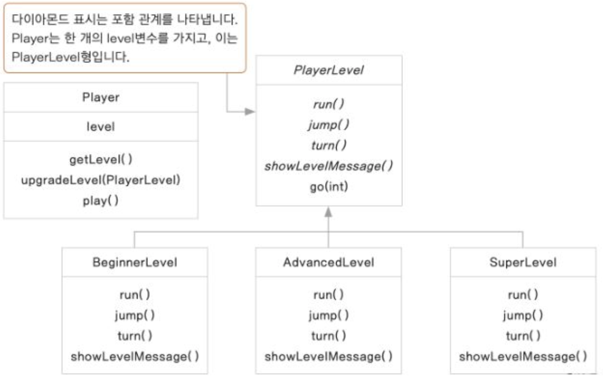

### 상태(state)패턴
전략패턴과 달리, 한 번 인스턴스를 생성하고 난 뒤, 상태를 바꾸는 경우가 빈번한 경우에 사용한다.

클래스가 하나의 상태에 따라 그 내부의 여러 메서드의 기능이 바뀐다고 하면 이를 각각의 클래스로 분리하기 위해 사용

특정 캐릭터가 레벨에 따라 행동을 다르게 한다 가정, 해당 레벨에 따른 행동들을 클래스화한다. 

1. 결과값이 다른, 동일한 함수를 가진 인터페이스 생성
2. 함수를 각각의 상황에 맞게 구현 클래스 각각구현
3. 실제 사용시 해당 레벨에 맞게 작동하도록 구현된 클래스를 넣어 준다(?여기에 팩토리패턴을 추가한다면)

ExCode의 statepattern3코드를 확인하자.