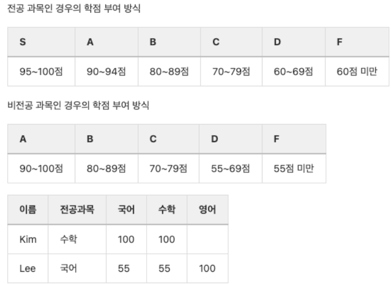
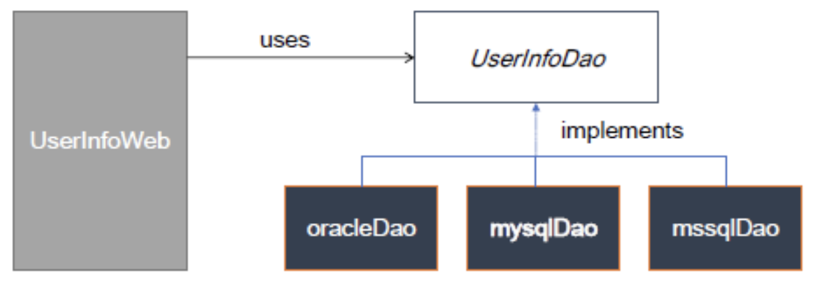

### 전략(strategy) 패턴
상태패턴과 달리, 한 번 인스턴스를 생성하고 나면, 상태가 거의 바뀌지 않는 경우에 주로 사용한다. 

프로젝트전체에서 변경이 일어나지 않는 부분에서 변경이 일어나는부분을 찾아서 캡슐화하는 것으로 이해
정책에 따른 등급 변동, 새로운 등급정책이 나올 때를 가정해 사용

- 다양한 알고리즘이 존재하면 이들 각각을 하나의 클래스로 캡슐화하여 알고리즘의 대체가 가능하도록 한다.
- 클라이언트와 독립적인 다양한 알고리즘을 적용할 수 있도록 한다.
- 사용자가 모르고 있는 데이터를 사용하여 여러 정책들이 반영될 수 있도록 구현
- 여러 정책이 수행되어야 하는 조건들 (if-else, switch) 문이 없어질 수 있다

예를 들어 학생의 과목성적이 전공, 부전공, 복수전공 이냐에 따라 다른성적을 받게 될 때 사용. 그리고 다른 성적정책이 추가된다면?  
이때 전략패턴을 사용한다.

ExCode의 strategypattrn3 참고

또는, DB가 변경될 때는?

ExCode의 strategypattrn3_6 참고