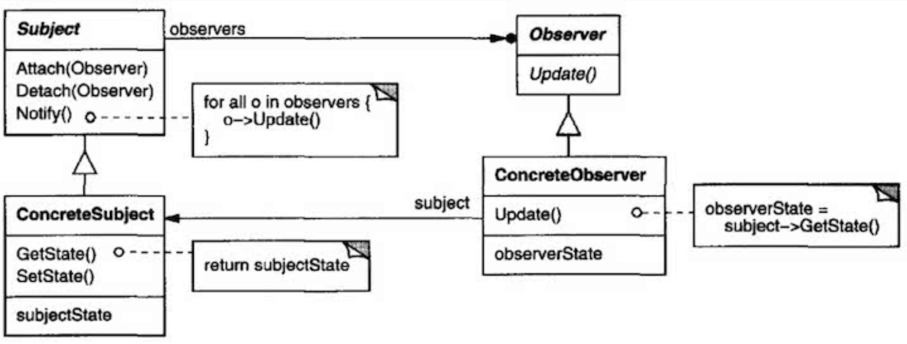

### 옵저버 패턴
어떤 객체의 상태가 변할 때 그와 연관된 객체 들에게 알림을 보내는 디자인 패턴이다.</br>
주로 분산 이벤트 핸들링 시스템을 구현하는 데 사용한다.



쉽게 설명하면, 우선 2개의 인터페이스를 만들자.</br>
옵저버 인터페이스(이하 A, 메시지를 받을 시 출력할 함수)와 옵저버인터페이스에 자신의 상태를 보내는 인터페이스(이하 B, 옵저버리스트 및 옵저버 추가/삭제 함수)를.</br>
B상속하여 구현한 B클래스는 자신의 상태나 호출시에 옵저버들에게 메시지를 보낼 수 있게 만들면 된다.</br>
그럼 A를 상속하여 구현된 A클래스 객체에서 메시지를 수신하여 출력하게 되면 모니터링이 가능할 것이다.</br>

코드는 ExCode의 observer 패키지 파일 참고.

```
실행결과
number : 4 //랜덤한 숫자 N
****  // N * N
****
****
****
number : 9 //랜덤한 숫자 M
```