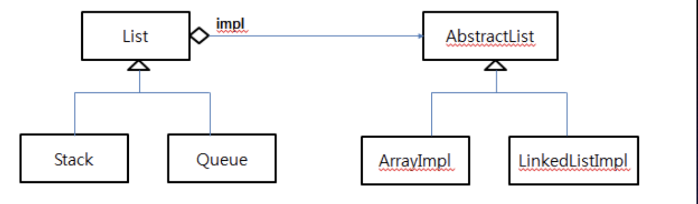
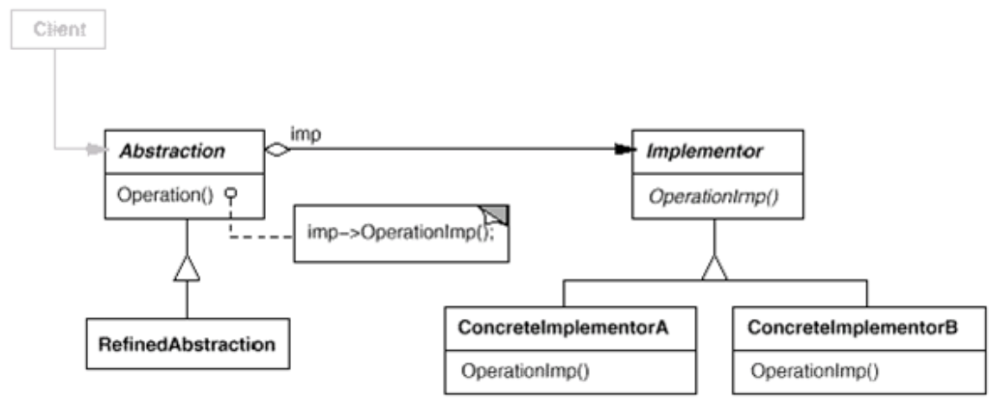

###브릿지
기능과 구현이 한 클래스에 있는 것을 나누기 위해 사용.</br>
기능(추상적인 개념)의 확장과 구현의 확장을 분리하는 용도로 사용.</br>
하나의 기능에 대한 다양한 구현이 적용될 수 있다. -> 구현부에 대한 참조를 가짐</br>

기능과 구현이 하나의 클래스에 있을 경우 리팩토링이 힘들어 진다.</br>
실행 중에 구현을 선택할 수도 있고, 사용하는 코드(클라이언트)에서는 기능 인터페이스를 사용하므로 구현에 대한 부분을 숨길 수 있음<br>
기능과 구현의 확장이 혼재 하면 상속관계가 복잡해 짐</br>
실행 중에 구현을 선택할 수도 있고, 사용하는 코드(클라이언트) 에서는 기능 인터페이스를 사용하므로 구 현에 대한 부분을 숨길 수 있음</br>
</br>
###ex)
List는 선형 자료의 추상적인 개념 List 하위에</br>
Stack과 Queue라는 개념이 있음</br>
List의 구현은 배열, 연결리스트 모두 가능</br>
```
		기능(개념)     ------->         구현
		  리스트                      추상리스트
	       /  	\		   /	    \
	    스택	         큐		배열	  연결리스트

	리스트에서 추상리스트의 멤버변수를 가진다.
	기능의 함수 실행시 구현부분의 함수가 실행하도록 한다.
```

ExCode의 코드 참고
