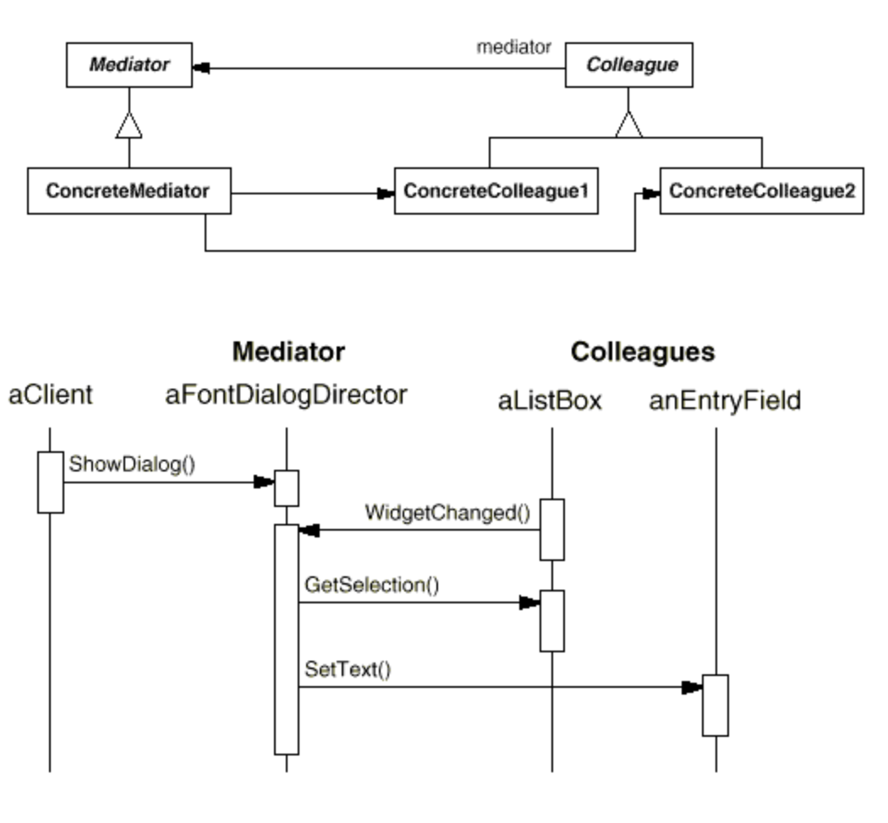

### 중재자(mediator)패턴

여러 객체(Colleague)간의 상호 작용이 많고 이 작용들이 다른 Colleague에도 영향을 줄 때 주로 UI 프로그램에서 많이 사용하는 방법 
Widget 상호간에 주과 받아야하는 메세지가 많은 경우, 이를 한 객체(Mediator)에서 전담하여 메세지를 처리하도록 함 
N:N의 관계가 1:N으로 줄어드는 효과 (counselor) 

하나의 컨트롤 타워를 만드다고 생각하면 편하다. 모든 소통은 컨트롤타워를 통하도록 하는 것.

옵저버 패턴과의 차이는 받기만 하는 것이 아닌 전송까지 포함하고 있다.

Mediator : Colleague 객체와 교류하는데 필요한 인터페이스를 정의 
ConcreteMediator : Colleague간의 이루어지는 협력을 구현하고, 자신의 Colleague들을 관리 
Colleague : Mediator의 참조자를 가지고 있고, 다른 객체와의 협력이 필요할때 Mediator에게 알림 

### 결론

다른 객체사이에 분산된 객체의 연관관계를 하나의 객체로 국한한다. 
Colleague 객체들 간의 종속성이 약화되어 결합도가 줄어든다. 
다대다의 관계를 일대다의 관계로 축소하여 이해하고 유지보수가 쉽다. 

ExCode의 mediator코드 참고

