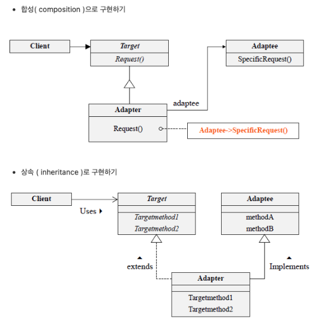
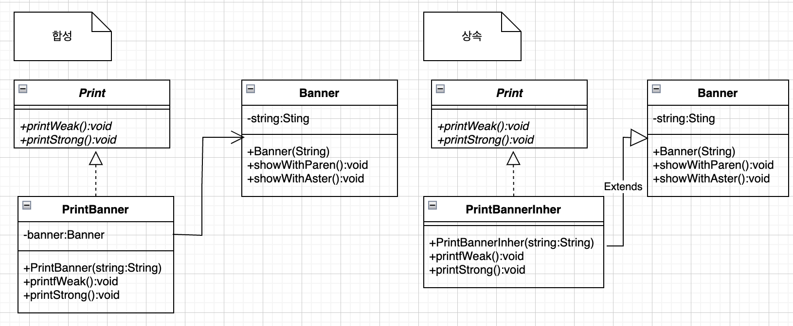

특정 인터페이스를 지원하지 않는 대상 객체를 인터페이스를 지원하는 Adapter에 집어넣어서 사용하는 방법 
 
서로 다른 인터페이스를 연결함 
클라이언트가 사용하던 방식대로 조정해 주는 객체 
안드로이드에서 View를 위한 Adapter들 
 

 
합성과 상속의 방법으로 어뎁터를 구현을 할 수 있음. 
단, 합성의 방법을 권장하는 추세이다. 
왜냐하면 대부분의 경우 상속이 바람직하지 않은 해결책일 수 있음을 염두해야 하기 때문. 

예제코드는 ExCode의 Adapter 패키지폴더 참고. 
아래는 예제코드의 이해를 돕기 위한 메인함수 읽기용 클래스 다이어그램. 
