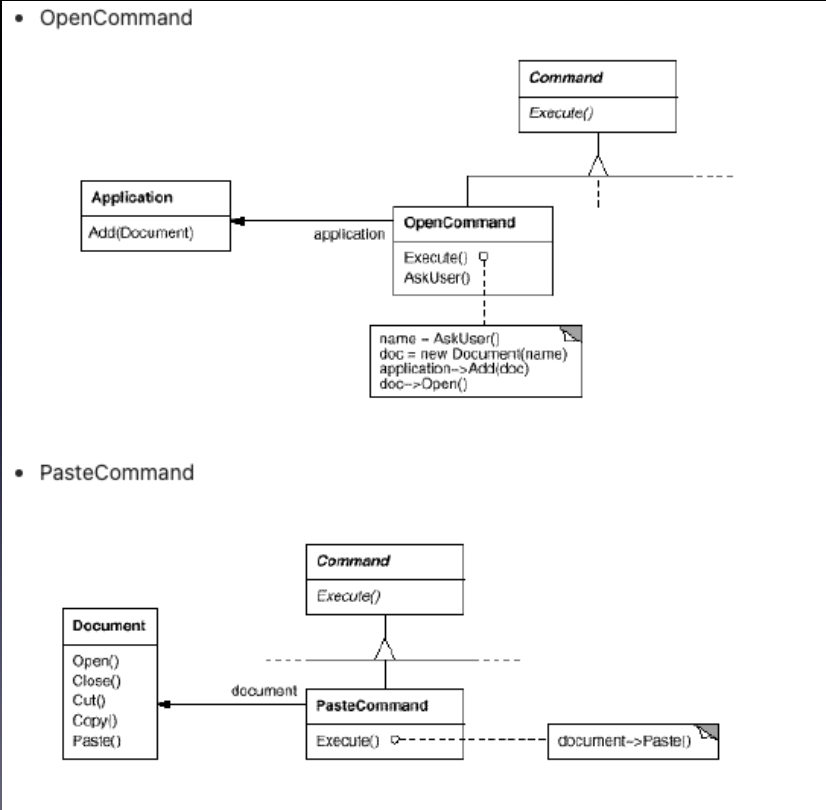

다양하게 처리되어야 하는 메뉴, 요청이 있을 때 이를 동일한 방식으로 처리될 수 있도록 함
명령을 보내는 쪽과 명령을 처리하는 쪽을 분리한다 (느슨한 구조)
여러 다른 명령 기능이 추가 되더라도 처리하는 방식이 동일하다.
Command 내부에서 요청을 처리할 대상 (receiver)에 대한 정보를 가지고 있어야 한다.
처리된 명령에 대한 히스토리가 유지되면 롤백할 수 있다.
여러개의 요청을 한꺼번에 일괄적으로 처리 할 수도 있다. (macro commnad)

