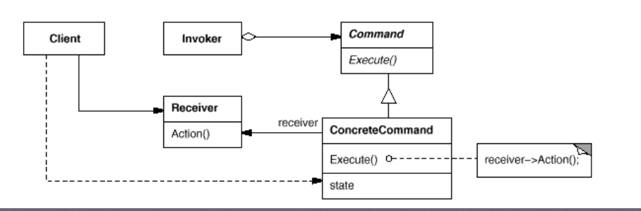

다양하게 처리되어야 하는 메뉴, 요청이 있을 때 이를 동일한 방식으로 처리될 수 있도록 함<br/>
명령을 보내는 쪽과 명령을 처리하는 쪽을 분리한다 (느슨한 구조)<br/>
여러 다른 명령 기능이 추가 되더라도 처리하는 방식이 동일하다.<br/>
Command 내부에서 요청을 처리할 대상 (receiver)에 대한 정보를 가지고 있어야 한다.<br/>
처리된 명령에 대한 히스토리가 유지되면 롤백할 수 있다.<br/>
여러개의 요청을 한꺼번에 일괄적으로 처리 할 수도 있다. (macro commnad)
<br/>


<br/>


<br/>
예제코드는 ExCode의 command 패키지폴더 참고.<br/>
아래는 예제코드의 이해를 돕기 위한 메인함수 읽기용 클래스 다이어그램.<br/>
```
예제코드는 다음을 만족하기위해 작성됨
 리모컨의 버튼들은 (invoker) 각각 다른 대상(receiver)에 대한 수행을 구한다고 하면 이를 어떻게 처리할 것인가?
0번 버튼 눌리면 (ON): 불을 켠다
0번 버튼 올라오면 (OFF) : 불을 끈다
1번 버튼 눌리면 (ON) : 에어켠이나 히터를 켠다
1번 버튼 올라오면 (OFF) : 에어켠이나 히터를 끈다
2번 버튼 눌리면 (ON) : 음악을 켠다
2번 버튼 올라오면 (OFF) : 음악을 끈다
3번 버튼 눌리면 (ON): 문을 연다
3번 버튼 올라오면 (OFF) : 문들 닫는다
```
<br/>
메인함수 구조의 간략화 버전<br/>

