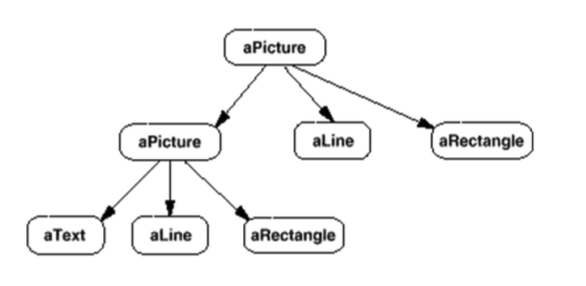
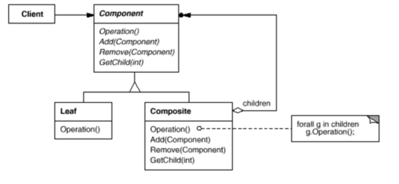
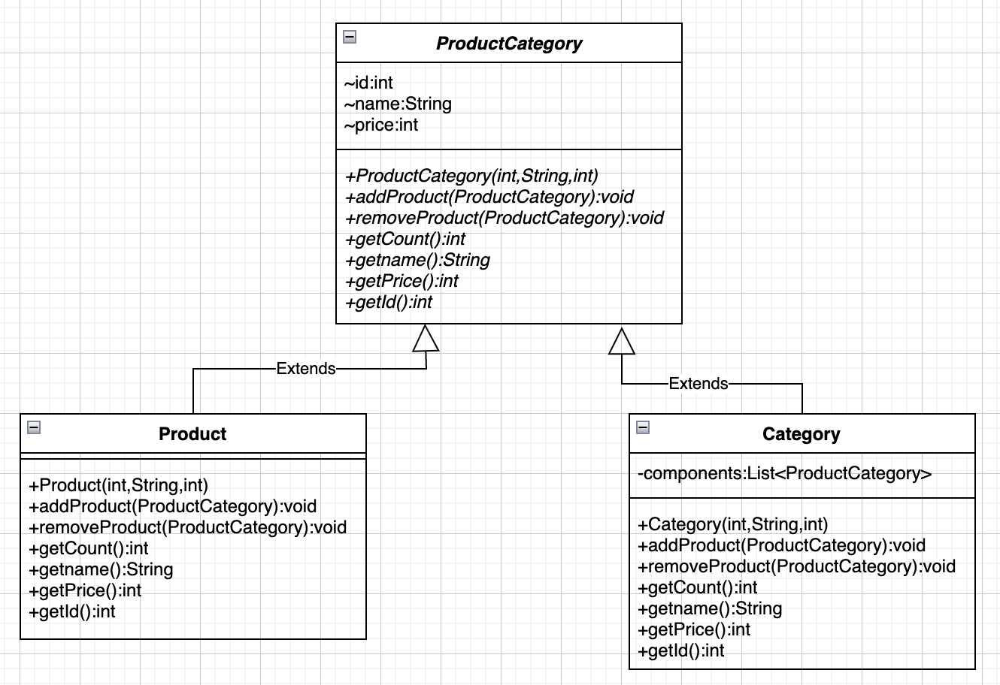
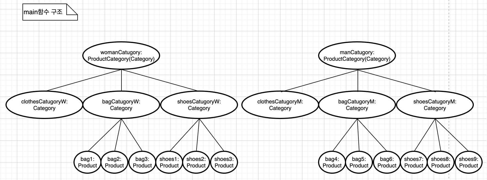

컴포지트란
OOP 에서 컴포지트(Composite) 는 하나 이상의 유사한 객체를 구성으로 설계된 객체로 모두 유사한 기능을 나타낸다. 이를 통해 객체 그룹을 조작하는 것처럼, 단일 객체를 조작할 수 있다.
 
컴포지트패턴이란
컴포지트 패턴은 클라이언트가 복합 객체(group of object) 나 단일 객체를 동일하게 취급하는 것을 목적으로 한다. 여기서 컴포지트의 의도는 트리 구조로 작성하여, 전체-부분(whole-part) 관계를 표현
 
트리 구조일 때 많이 사용 됨 
재귀적인 구조 
단일 객체는 복합 객체에 포함되고, 복합 객체 역시 또다른 복합 객체에 포함이 되는 구조 복합 객체와 단일 객체를 구분하여 (if, instanceof 등을 사용) 구현하지 않는 편의성 
객체의 단일성 vs. 클라이언트의 편의성(컴포지트패턴은 클라이언트의 편의성을 생각한다.) 

 

"Client" 클래스는 "Leaf" 와 "Composite" 클래스를 직접 참조하지 않고, 공통 인터페이스 "Component" 를 참조하는 것을 볼 수 있다. 
"Leaf" 클래스는 "Component" 인터페이스를 구현한다. 
"Composite" 클래스는 "Component" 객체 자식들을 유지하고, operation() 과 같은 요청을 통해 자식들에게 전달한다. 

예제코드는 ExCode의 composite 패키지폴더 참고. 
아래는 예제코드의 이해를 돕기 위한 메인함수 읽기용 클래스 다이어그램. 

